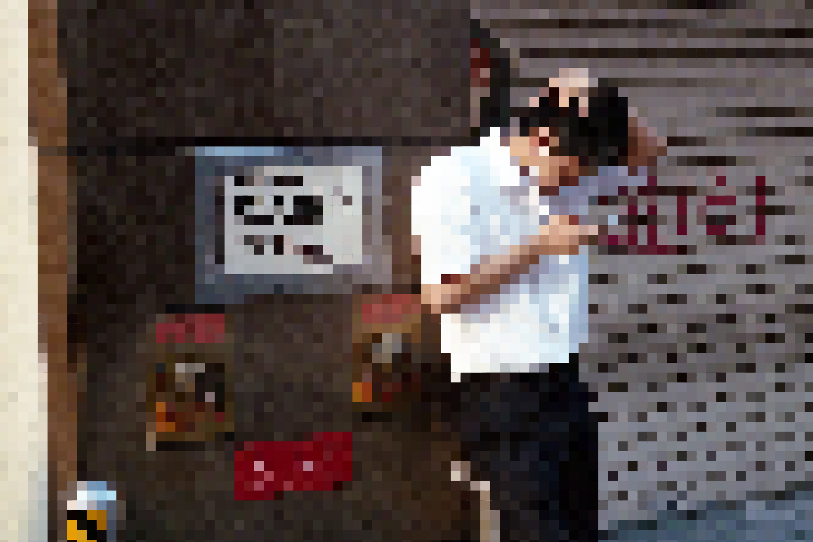

# practica-mateo-2024

## lateralImageEditor manual de uso

### barra lateral y usos

 12.42.59.png>)

en orden de arriba hacia abajo tenemos los siguientes efectos y sliders para editarlos

* GENERAL - cargar imagen: podemos subir una imagen desde nuestro pc
* GENERAL - color primario: color a elección 1
* GENERAL - color secundario: color a elección 2
* THRESHOLD - habilitar: habilitar o deshabilitar efecto threshold```
* THRESHOLD - nivel: podemos cambiar el nivel del efecto
* BITMAP - habilitar: habilitar o deshabilitar efecto bitmap
* BITMAP - columnas: con las columnas podemos elegir entre más o menos denso se ve el bitmap
* PIXELADO - habilitar: habilitar o deshabilitat efecto de pixelado
* PIXELADO - resolución: podemos elegir densidad de pixeles

### ejemplos

### imagen con bitmap

EXPLICAR QUE HACE EL EFECTO
MOSTRAR EN EL MENU COMO SE HABILITA




.png)


.png>)


## manual para desarrollo en terminal

```zsh
# listar - muestra lo que hay en el directorio
ls
```

```zsh
# directorio donde estoy - ruta del archivo
pwd 
```

```zsh
# change directory - ir a carpeta X
cd X
```

```zsh
#  ir una carpeta atrás
cd ..
```

```zsh
# imprimir historial
history
```

```zsh
# abrir finder donde te encuentras
open . 
```

```zsh
- incluir archivo X
git add X
```

```zsh
- incluir todos los cambios en el directorio actual
git add .
```

```zsh
# hacer un commit en mi máquina con un mensaje
git commit -m "MENSAJE"
```

```zsh
# subir los cambios a la nube
git push 
```

```zsh
# incorporar a mi máquina los cambios desde la nube
git pull 
```

```zsh
# deshacer cambios en el directorio de trabajo
git stash
```

## instrucciones para correr el proyecto desde terminal

```zsh
# ir al directorio del proyecto
cd my-project
```

```zsh
# instalar node_modules
npm install
```

```zsh
# correr el proyecto
npm run dev
```
