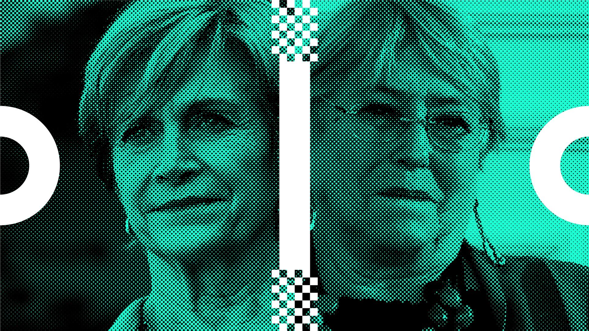

# cosas por programar

## 21.08.2024 - cosas para my-proyect

1. deberíamos hacer que todos los filtros sean activables, para poder subir la foto, verla cómo es originalmente, y luego ir decidiendo qué filtros le van quedando bien.

2. (tarea para mateo) ir cambiando las propiedades de halftone, agregar cuadrados, triángulos, etc.

3. incluir animaciones para la manipulación de imágenes, en principio, efecto glitch. 
Referencia: https://p5.glitch.me/ 

4. agregar efecto duotono, manipular imagen para que use sólo dos colores. 

 

## 21.08.2024 - reunión con Manuel Córdova

1. podríamos incluir la herrmienta que estamos desarrollando en mechanic con Aarón, para manipular imágenes, dentro de revistalateral.cl, pensamos que editores puedan tener a disposición una herramienta intuitiva para destruir/manipular imágenes, y puedan usarla para la portada, cuerpo, etc, de su artículo.

2. pensamos que la diseñadora [amuki](https://amuki.com.ec/amuki-tools/) nos puede servir como referente de esto, tiene herramientas de manipulación de imágenes, creación de letras, perlin noise, etc. 

3. por otro lado manuel piensa en animar el logo de lateral cada vez que hagamos scroll en la web, tenemos de referencia el juego snake de nokia. Tenía en mente dos opciones, una donde la cabeza de la snake fuera la flecha, y fuera persiguiéndose la cola infinitamente, la otra opción era que la flecha desapareciera y fuera haciendo círculos al rededor del logo sin fin.

